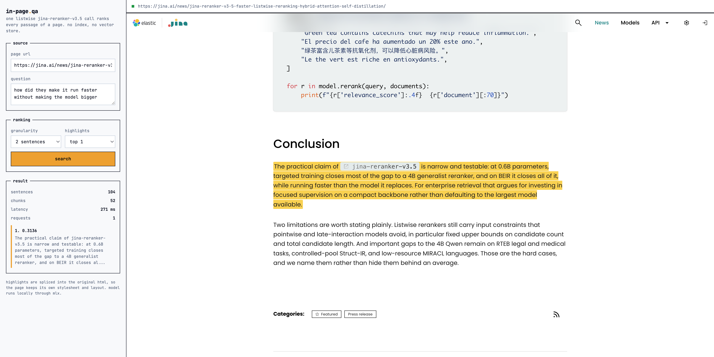
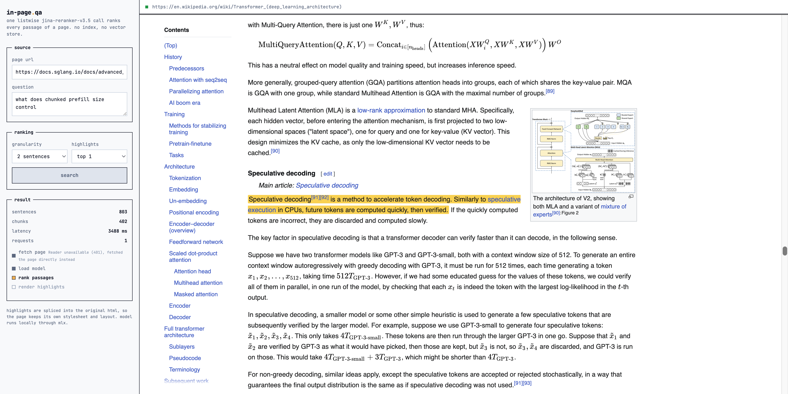
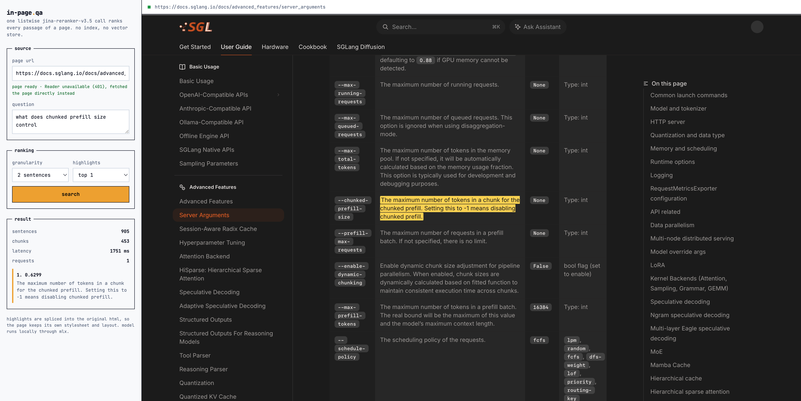
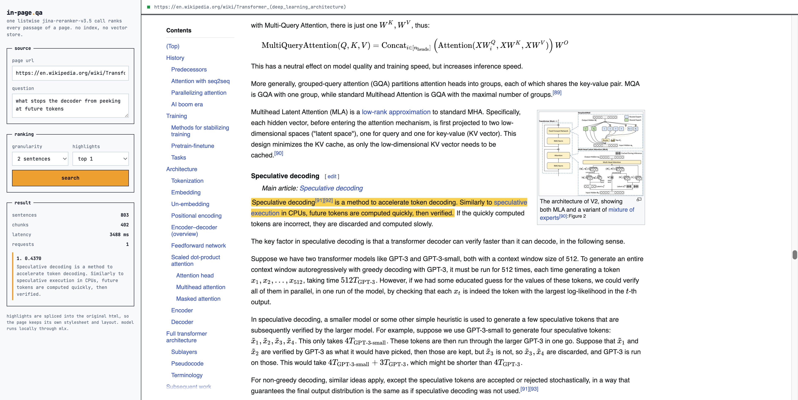
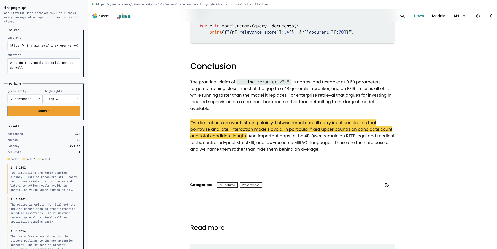
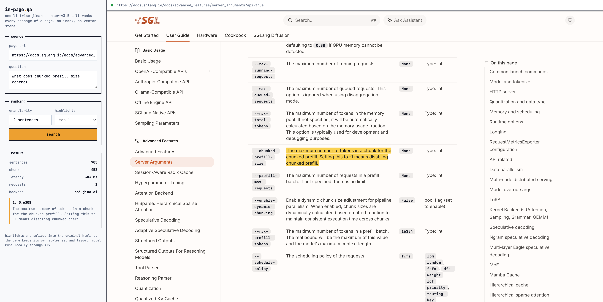

# jina-reranker-v3.5-in-page-search

Ask a page a question, get the answer highlighted in the page itself. One
listwise [jina-reranker-v3.5](https://huggingface.co/jinaai/jina-reranker-v3.5)
call ranks the whole document. No index, no vector store, no chunk database.
Runs locally on Apple Silicon via MLX.



104 sentences, 52 chunks, 271 ms, one request. The question was "how did they
make it run faster without making the model bigger". No content word in it
appears in the sentence it found.

```bash
inpage-serve --model-dir ~/models/jina-reranker-v3.5-mlx
```

Settings left, rendered page right. Highlights are spliced into the source HTML
as `<mark>`, so the page keeps its own CSS, fonts, tables and figures.

## Why listwise

Normal in-document search: embed every chunk, store vectors, embed query, ANN
lookup. Every reason for that stack disappears when the corpus is one page.

**An index amortizes over many queries. This corpus lives for one page view.**
Building embeddings and querying them back is more work than one forward pass
over the same text.

**Bi-encoders score each chunk blind to the others.** A chunk's vector is
computed before the other chunks exist. But relevance inside a document is
comparative: three paragraphs mention latency, which one answers the question?
Listwise packs query + all candidates into one context and runs self-attention
across them, so each passage is scored against its competitors. ColBERT-style
late interaction gives this up by design.

**A page fits in one context.** 131K tokens. A 74 KB post is 104 sentences, 52
chunks, ~3.5K tokens. Whole document in, answer out in 271 ms on an M3 Ultra.

**Plain questions beat Ctrl-F**, which needs you to already know the wording.

Counter-argument: quadratic attention over long lists is expensive, which is
what v3.5's hybrid attention fixes. At a million documents you still want a
first-stage retriever. At one page, the retriever is what you delete.

## More

Progress streams while it runs, so a slow fetch or the one-off model load is
visible instead of looking hung:



Page is fetched while you type the question. Settle on a url, the server pulls
it and warms the weights in the background. 345-sentence page: 1.35s cold,
1.09s prefetched, ranking unchanged. Fetch is off the critical path.

Dark-themed docs keep their theme, nav and table layout:



Wikipedia keeps its sidebar, infoboxes and rendered math:



`Highlights: top 3` shades runners-up and lists them with scores. Click one to
jump to it:



## Pipeline


The source HTML is never re-rendered. Sentences carry byte offsets into the
original markup, ranked chunks map back through those offsets, `<mark>` gets
spliced in.

## The model

From [arXiv:2607.18152](https://arxiv.org/abs/2607.18152):

**LBNL interaction.** All passages concatenated with delimiter tokens, query in
a trailing block. Causal self-attention over the whole sequence, contextual
embeddings read at the special token positions, two-layer MLP projects to 512-d,
cosine similarity scores.

**Hybrid 3L2G.** Three sliding-window layers then two global, repeating. 17
local and 11 global across 28 layers, window w=1024. Drops attention from
`O(L²)` to `O(L·w)` on the local layers.

**Pinned terminal global layer.** The interesting constraint. The query token
sits at the end of the sequence and must attend back to the first candidate to
be cross-document-aware. A finite window severs exactly that. So the last layer
stays global always (`G*`). Swapping it for a sliding window wrecked ranking.
No such constraint exists in generative LMs, which is what separates this from
Gemma 3's local-global schedule.

**Self-distillation across an attention mismatch.** Teacher and student are both
0.6B, differing only in attention pattern. Full-attention teacher sets the
ceiling; student activates 3L2G, retrains attention projections alone to learn
routing under the sparse mask, then matches teacher representations. Adapt the
geometry before matching behaviour.

| Benchmark | v3 | v3.5 | |
|---|---|---|---|
| BEIR nDCG@10 | 62.10 | **63.20** | beats Qwen3-Reranker-4B at 62.28, ~7x fewer params |
| MIRACL | 72.20 | **74.11** | best at 0.6B |
| RTEB | 68.01 | **70.95** | +14.0 AILA-Statute, +11.7 AILA-Case |
| Struct-IR | 38.7 | **48.3** | +9.6, biggest gain |

A100, bs=1, top-100 listwise, FlashAttention-2: BEIR NQ 371ms to 305ms (1.22x),
RTEB AILACasedocs 16.1s to 10.3s (1.56x). Pays off most on long passages, which
is where a full web page lands.

## Install

Apple Silicon required.

```bash
git clone https://github.com/hanxiao/jina-reranker-v3.5-in-page-search
cd jina-reranker-v3.5-in-page-search
uv venv && source .venv/bin/activate
uv pip install -e .
hf download jinaai/jina-reranker-v3.5-mlx --local-dir ~/models/jina-reranker-v3.5-mlx
```

## Use

```bash
inpage-serve --model-dir ~/models/jina-reranker-v3.5-mlx
```

<http://127.0.0.1:8000>. No key, no account, no config.

Stdlib `http.server`, no web framework. `POST /api/search` streams progress as
SSE. `POST /api/prefetch` fires 700ms after the url field settles, caches the
page and loads weights in a background thread, reports nothing (anything broken
resurfaces in search, which reports properly).

CLI:

```bash
inpage --url https://jina.ai/news/jina-reranker-v3-5-faster-listwise-reranking-hybrid-attention-self-distillation/ \
       -q "how did they make it run faster without making the model bigger" \
       --model-dir ~/models/jina-reranker-v3.5-mlx --open
```

```
104 sentences -> 52 chunks, 271 ms in a single request via local (mlx)
  [1] 0.3136  The practical claim of jina-reranker-v3.5 is narrow and testable: at 0.6B...
```

Library:

```python
from inpage import InPageSearcher, fetch_html

searcher = InPageSearcher("~/models/jina-reranker-v3.5-mlx")
result = searcher.search(fetch_html(url), "why did the second attempt fail?", top_n=1)
for hit in result.hits:
    print(hit.rank, round(hit.score, 4), hit.text[:100])
```

| Flag | Default | |
|---|---|---|
| `-q, --question` | required | Plain language, keywords not needed |
| `-g, --granularity` | `2` | Sentences per chunk |
| `-n, --top-n` | `1` | Chunks to highlight |
| `--url` / `--file` | | Fetch, or read local |
| `--api` | off | Rank via api.jina.ai |
| `--open` | off | Open in browser |

`inpage-serve` takes `--model-dir`, `--host`, `--port`, `--no-open`.

Granularity is a real trade-off. `1` gives tight highlights but splits answers
that span two sentences. `3` catches more context, costs more tokens.

### ?api=true

Append it to the url and that search runs on api.jina.ai instead of local
weights. Needs `JINA_API_KEY`.



Flag is stripped before fetching. Weights are not loaded if unused. The
`backend` row says which ran.

| backend | 453 chunks |
|---|---|
| local, M3 Ultra | 1751 ms, 0.6299 |
| api.jina.ai | 383 ms, 0.6308 |

~4.5x faster including the round trip, on much better hardware than a laptop.
Local stays default: no key, no network.

## Getting the page

1. [Jina Reader](https://jina.ai/reader/) renders client-side pages, returns
   clean markup. Anonymous use is rate limited and some networks are refused
   outright: *"blocked from performing anonymous queries due to bad network
   reputation"*.
2. Plain HTTP GET. No key, no account.

So the key is optional. Set `JINA_API_KEY` for Reader's rendering on JS-heavy
pages, otherwise it falls back to a direct fetch. For server-rendered docs and
articles the direct fetch is fine. Every screenshot here was made without a key.

## Four things that took real debugging

**Chunks must not span block boundaries when highlighted.** Two sentences can
straddle an `<h2>`. Highlighting `first.start..last.end` swallows the heading.
Fix: one span per sentence, merge adjacent spans only across blank or inline
markup. Overlapping hits still render as one block; headings and table cells
break it.

**Code blocks are not prose.** A `<pre>` listing glued to the sentence beside it
drags the chunk's score around. Excluding `pre`/`code` moved the top hit from a
code-polluted chunk at 0.2745 to the answer at 0.3079.

**urllib's default User-Agent gets 403'd.** `Python-urllib/3.x` is refused at
the edge before reaching Reader or api.jina.ai, key or not, and Cloudflare
returns a 1010 that reads exactly like an auth failure. Both clients send their
own agent. Cost me time twice.

**`hidden` loses to `display`.** Any element with explicit `display: flex` in
CSS ignores the `hidden` attribute. Bit me three times in this one file, so
every such rule now has a matching `[hidden] { display: none }`.

## Known limits

- Highlights are the top-ranked sentences, not extracted answer spans. This is
  retrieval, not reading comprehension.
- Question-shaped sentences attract questions. Ask "what killed her?" of a
  detective story and the top hit is often a character asking the same thing.
  It genuinely is the most similar sentence.
- Client-side-only pages give Reader little to return.
- Fixed caps on candidate count and total length. Very long pages get split into
  multiple blocks by the checkpoint's own batching, which costs the single-call
  property.

## Tests

```bash
python -m pytest tests/ -q
```

The offset contract is the one worth having: every sentence span, sliced out of
the source HTML, must reproduce that sentence.

## License

Apache 2.0 for this code. The model is **CC-BY-NC-4.0**, non-commercial.
[Contact Jina AI](https://jina.ai/contact-sales/) for commercial use.

```bibtex
@misc{nasika2026jinarerankerv35efficientlistwisereranker,
      title={jina-reranker-v3.5: An Efficient Listwise Reranker with Hybrid Attention and Self-Distillation},
      author={Christina Nasika and Feng Wang and Antonis Krasakis and Han Xiao},
      year={2026},
      eprint={2607.18152},
      archivePrefix={arXiv},
      primaryClass={cs.IR},
      url={https://arxiv.org/abs/2607.18152},
}
```
