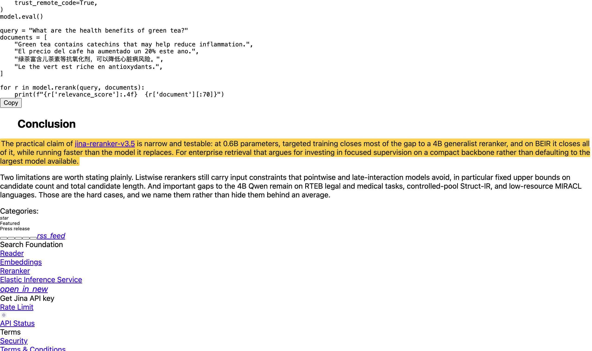
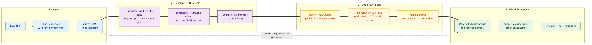
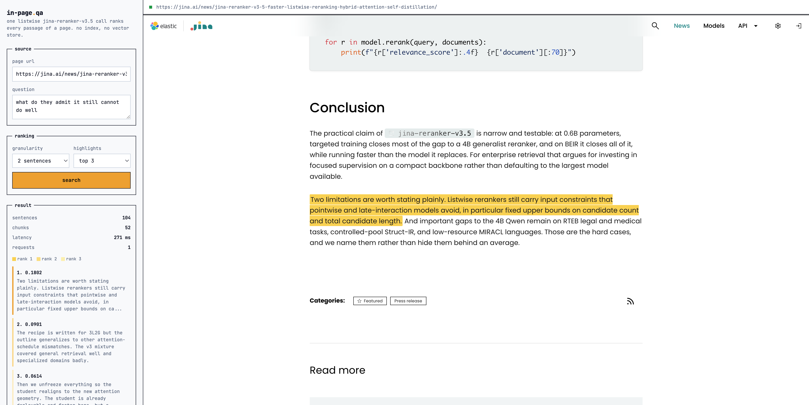
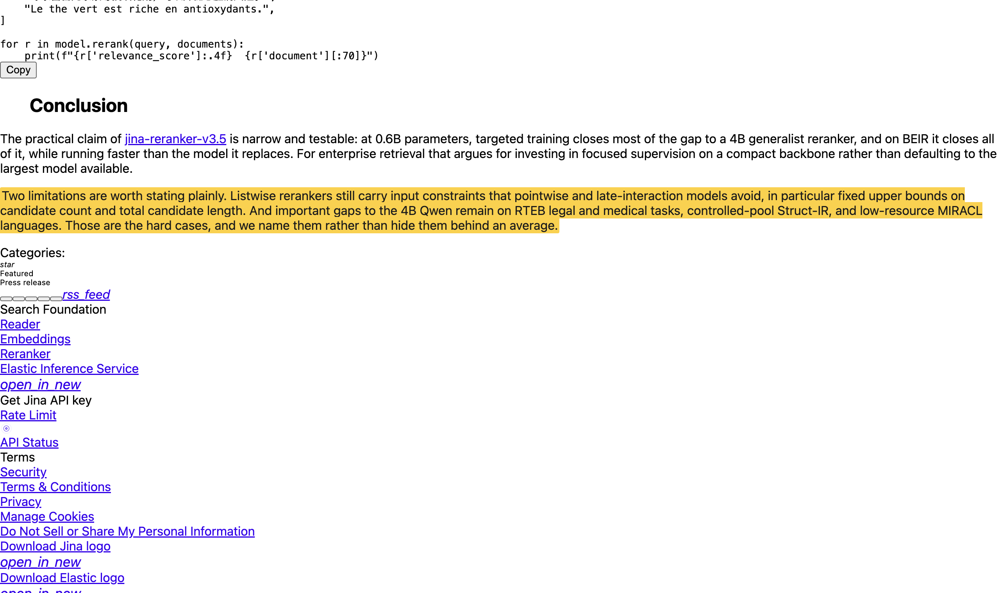

# jina-reranker-v3.5-in-page-search

Ask a web page a question in plain language and get the answer highlighted **in
the page itself**, not in a stripped-down copy of it. One listwise
[jina-reranker-v3.5](https://huggingface.co/jinaai/jina-reranker-v3.5) call
ranks the whole document. No embedding index, no vector store, no chunk
database. Runs locally on Apple Silicon through MLX.



The question above was *"how did they make it run faster without making the
model bigger"*. Not one content word in it appears in the sentence it found.

## Why this works without an index

The usual way to search inside a document is to embed every chunk, store the
vectors, embed the query, and take nearest neighbours. That machinery exists
because scoring each chunk *independently* is cheap and parallel.

A listwise reranker does the opposite and that turns out to be the right trade
here. jina-reranker-v3.5 packs the query and **every candidate** into a single
context window and runs self-attention across all of them at once, so each
passage is scored while the model can see its competitors. For a single web
page the entire document fits in one call: a 74 KB blog post is 98 sentences,
49 chunks, and **one request that returns in about 260 ms** on an M3 Ultra.

Building an index for a document you are going to read once is wasted work.

## Pipeline



The one idea worth stating plainly: **the source HTML is never re-rendered.**
Sentences are extracted with their byte offsets into the original markup, the
reranker's output is mapped back through those offsets, and `<mark>` tags are
spliced in. So the page keeps its own stylesheet, layout, tables, and figures,
and the highlight lands inside them.

## How jina-reranker-v3.5 scores a list

From the paper, [arXiv:2607.18152](https://arxiv.org/abs/2607.18152):

**Last-but-not-late (LBNL) interaction.** A listwise prompt concatenates all
passages with delimiter tokens and places the query in a trailing block. Causal
self-attention over the full sequence produces contextual embeddings at those
special token positions, a two-layer MLP projects them into a **512-dimensional**
space, and query and document vectors are compared by **cosine similarity**.
Joint encoding is what gives LBNL in-context cross-document comparison, which
late-interaction models like ColBERT lack because they encode passages
independently.

**Hybrid 3L2G attention.** Full attention at all 28 layers dominates compute
when candidate lists get long. v3.5 repeats **three sliding-window layers
followed by two global layers**, giving 17 local and 11 global layers with a
window of **w = 1024** tokens. Local layers drop attention cost from `O(L²)` to
`O(L·w)`.

**The pinned terminal global layer.** This is the constraint that makes the
architecture interesting. The query embedding token sits at the *end* of the
sequence and has to attend back to the *first* candidate to be
cross-document-aware — and a finite window severs exactly that dependency. So
the final layer stays global no matter what (`G*` in the paper). Replacing it
with a sliding window severely degraded ranking. This readout constraint does
not exist in generative language modelling, and it is what separates this
backbone from prior local-global systems like Gemma 3.

**Self-distillation across an attention mismatch.** Teacher and student are the
same size (0.6B) and differ *only* in attention pattern. A full-attention
teacher sets the upper bound; the student then activates 3L2G, first retraining
only the attention projections to learn routing under the sparse mask, then
matching the teacher's representations. Adapting the geometry *before* matching
behaviour is what recovers the gap.

### Reported results

| Benchmark | v3 | **v3.5** | Note |
|---|---|---|---|
| BEIR (nDCG@10) | 62.10 | **63.20** | above Qwen3-Reranker-4B at 62.28, ~7× fewer params |
| MIRACL | 72.20 | **74.11** | best among 0.6B models |
| RTEB | 68.01 | **70.95** | +14.0 on AILA-Statute, +11.7 on AILA-Case |
| Struct-IR (controlled pool) | 38.7 | **48.3** | +9.6, the largest gain |

Latency, A100, batch size 1, top-100 listwise, FlashAttention-2: BEIR NQ
371 ms → 305 ms (**1.22×**); RTEB AILACasedocs 16.1 s → 10.3 s (**1.56×**).
The hybrid schedule pays off most when passages are long.

## Install

Apple Silicon required (MLX).

```bash
git clone https://github.com/hanxiao/jina-reranker-v3.5-in-page-search
cd jina-reranker-v3.5-in-page-search
uv venv && source .venv/bin/activate
uv pip install -e .
```

Then fetch the checkpoint (~1.1 GB):

```bash
hf download jinaai/jina-reranker-v3.5-mlx --local-dir ~/models/jina-reranker-v3.5-mlx
```

## Use

### Web UI

```bash
export JINA_API_KEY=...                # https://jina.ai/api-dashboard/
inpage-serve --model-dir ~/models/jina-reranker-v3.5-mlx
```

Opens on <http://127.0.0.1:8000>. Settings on the left, the rendered page on
the right.



The right pane is **the page itself**, not a reconstruction of it. Highlights
are spliced into the source HTML as `<mark>` tags, so every stylesheet, font,
table and figure the page shipped with is still there -- the screenshot above
keeps the blog's own typography and code blocks untouched. Ranked hits are
listed bottom left with their scores; clicking one scrolls the page to it.

The backend is a stdlib `http.server` with a single JSON endpoint,
`POST /api/search` -- no web framework. The model loads once on the first
request and is reused, and the last page fetched is cached, so changing
granularity or top-n re-ranks without re-fetching.

### Command line

```bash
export JINA_API_KEY=...   # https://jina.ai/api-dashboard/

inpage --url https://jina.ai/news/jina-reranker-v3-5-faster-listwise-reranking-hybrid-attention-self-distillation/ \
       -q "how did they make it run faster without making the model bigger" \
       --model-dir ~/models/jina-reranker-v3.5-mlx \
       --open
```

```
98 sentences -> 49 chunks, 268 ms in a single request
  [1] 0.3079  The practical claim of jina-reranker-v3.5 is narrow and testable: at 0.6B
                parameters, targeted training closes most of the gap to a 4B generalist...
Wrote highlighted.html
```

Works on a local file too, no network needed:

```bash
inpage --file examples/jina-reranker-v3.5-blog.html -q "what do they admit it still cannot do well" -n 3
```

### As a library

```python
from inpage import InPageSearcher, fetch_html

searcher = InPageSearcher("~/models/jina-reranker-v3.5-mlx")
html = fetch_html("https://example.com/article")

result = searcher.search(html, "why did the second attempt fail?", granularity=2, top_n=1)
print(result.sentence_count, result.chunk_count, result.elapsed_ms)
for hit in result.hits:
    print(hit.rank, round(hit.score, 4), hit.text[:100])

open("out.html", "w").write(result.html)
```

### Options

| Flag | Default | What it does |
|---|---|---|
| `-q, --question` | required | Plain-language question; keywords not required |
| `-g, --granularity` | `2` | Sentences per chunk sent to the reranker |
| `-n, --top-n` | `1` | How many ranked chunks to highlight |
| `--url` / `--file` | — | Fetch through Reader, or read a local file |
| `--open` | off | Open the result in a browser |

`inpage-serve` takes `--model-dir`, `--host`, `--port` and `--no-open`.

Granularity is a real trade-off. At `1` the highlight is tight but an answer
split across two sentences can be cut in half. At `3` you catch more context
and spend more tokens. `2` is a reasonable default.

`top_n` 2 and 3 shade the lower ranks in lighter yellow:



## Two details that took real debugging

**Chunks must not span block boundaries when highlighted.** A chunk of two
sentences can straddle an `<h2>`. Highlighting `first.start .. last.end` in one
range swallows the heading. Fix: emit one span *per sentence*, then merge
adjacent spans only when the HTML between them is blank or purely inline
markup. Overlapping hits still render as one continuous block; headings,
captions and table cells break it.

**Code blocks are not prose.** Left in the candidate list, a `<pre>` listing
gets glued to the sentence beside it and drags the chunk's score around. On the
example page, excluding `pre`/`code` moved the top hit from a code-polluted
chunk at 0.2745 to the actual answer sentence at 0.3079.

**Reader refuses urllib's default User-Agent.** `Python-urllib/3.x` is turned
away at the edge with a 403 before the request reaches the API, with or without
a key, so `reader.py` sends its own agent string. Worth knowing if you write
your own client and cannot see why curl succeeds where Python does not.

## Known limits

- Highlights land on **sentences the reranker ranked highest**, which is not the
  same as an extracted answer span. This is retrieval, not reading comprehension.
- **Question-shaped sentences attract questions.** Ask "what killed her?" of a
  detective story and the top hit is often a character asking the same thing,
  because that is genuinely the most semantically similar sentence.
- Pages that render entirely client-side give the Reader little to return.
- The model has fixed upper bounds on candidate count and total candidate
  length, as the paper notes. Very long pages get chunked into multiple blocks
  by the checkpoint's own batching.

## Tests

```bash
python -m pytest tests/ -q
```

The offset contract is the thing worth testing: every sentence span, sliced out
of the source HTML, must reproduce that sentence.

## License

Apache 2.0 for this code. The model,
[jina-reranker-v3.5](https://huggingface.co/jinaai/jina-reranker-v3.5), is
**CC-BY-NC-4.0** — non-commercial.
[Contact Jina AI](https://jina.ai/contact-sales/) for commercial use.

```bibtex
@misc{nasika2026jinarerankerv35efficientlistwisereranker,
      title={jina-reranker-v3.5: An Efficient Listwise Reranker with Hybrid Attention and Self-Distillation},
      author={Christina Nasika and Feng Wang and Antonis Krasakis and Han Xiao},
      year={2026},
      eprint={2607.18152},
      archivePrefix={arXiv},
      primaryClass={cs.IR},
      url={https://arxiv.org/abs/2607.18152},
}
```
